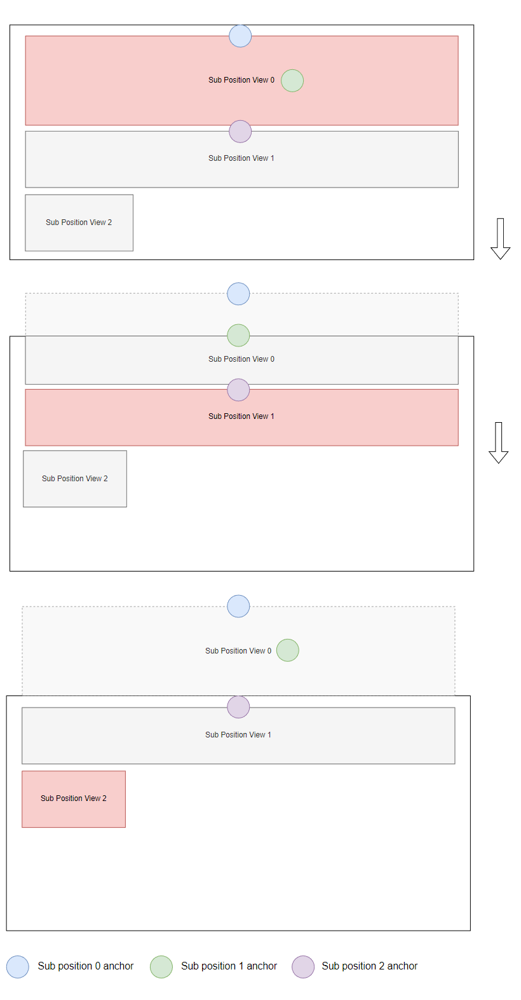

# Alignment Recipes

## Center alignment

Example of centering views in a vertical `DpadRecyclerView`:


=== "XML"

    ```xml linenums="1"
    <com.rubensousa.dpadrecyclerview.DpadRecyclerView
        android:id="@+id/recyclerView"
        android:layout_width="match_parent"
        android:layout_height="match_parent"
        android:orientation="vertical"
        app:dpadRecyclerViewChildAlignmentFraction="0.5"
        app:dpadRecyclerViewParentAlignmentFraction="0.5" />
    ```

=== "Kotlin"

    ```kotlin linenums="1"
    recyclerView.setParentAlignment(
        ParentAlignment(fraction = 0.5f)
    )
    recyclerView.setChildAlignment(
        ChildAlignment(fraction = 0.5f)
    )
    ```


## Start alignment

Example of aligning views in a horizontal `DpadRecyclerView`:


=== "XML"

    ```xml linenums="1"
    <com.rubensousa.dpadrecyclerview.DpadRecyclerView
        android:id="@+id/recyclerView"
        android:layout_width="match_parent"
        android:layout_height="match_parent"
        android:orientation="horizontal"
        app:dpadRecyclerViewChildAlignmentFraction="0"
        app:dpadRecyclerViewParentAlignmentOffset="24dp"
        app:dpadRecyclerViewParentAlignmentFraction="0" />
    ```

=== "Kotlin"

    ```kotlin linenums="1"
    recyclerView.setParentAlignment(
        ParentAlignment(
            fraction = 0f, 
            offset = 24.dp.toPx()
        )
    )
    recyclerView.setChildAlignment(
        ChildAlignment(fraction = 0f)
    )
    ```

If you want all items to be aligned to the keyline, even the ones at the start or end of the list,
you need to set an edge preference of `ParentAlignment.Edge.NONE`

=== "XML"

    ```xml linenums="1"
    <com.rubensousa.dpadrecyclerview.DpadRecyclerView
        <!-- Other attributes -->
        app:dpadRecyclerViewParentAlignmentEdge="none" />
    ```

=== "Kotlin"

    ```kotlin linenums="1"
    recyclerView.setParentAlignment(
        ParentAlignment(
            fraction = 0f, 
            offset = 24.dp.toPx()
            edge = ParentAlignment.Edge.NONE
        )
    )
    ```

## Including padding in child alignment


In case you want to include padding for the alignment position, set the `includePadding` to true:

```kotlin
recyclerView.setChildAlignment(
    ChildAlignment(fraction = 0f, includePadding = true)
)
```

Padding will only be considered in the same orientation of the `DpadRecyclerView` and when the ratio is either `0f` or `1f`:

* start/top padding for horizontal/vertical when `fraction` is 0f
* end/bottom padding for horizontal/vertical when `fraction` is 1f

## Sub position alignment

You can define custom sub positions for every `ViewHolder` to align its children differently.
Each sub position alignment is essentially an extension of `ChildAlignment`.



In this example, we have 3 sub position alignments:

1. Sub position 0 is aligned to the parent keyline
2. Sub position 1 is aligned to the half of the view at sub position 0
3. Sub position 2 is aligned to the top of the view at sub position 1

To achieve this, make your `RecyclerView.ViewHolder` implement `DpadViewHolder` and return the configuration in `getSubPositionAlignments`:

```kotlin linenums="1"
class ExampleViewHolder(
    view: View
) : RecyclerView.ViewHolder(view), DpadViewHolder {

    private val alignments = ArrayList<SubPositionAlignment>()

    init {
        alignments.apply {
            add(
                SubPositionAlignment(
                    fraction = 0f,
                    alignmentViewId = R.id.firstView,
                    focusViewId = R.id.firstView
                )
            )
            add(
                SubPositionAlignment(
                    fraction = 0.5f,
                    alignmentViewId = R.id.firstView,
                    focusViewId = R.id.secondView
                )
            )
            add(
                SubPositionAlignment(
                    fraction = 0f,
                    alignmentViewId = R.id.secondView,
                    focusViewId = R.id.thirdView
                )
            )
        }
    }

    override fun getSubPositionAlignments(): List<SubPositionAlignment> {
        return alignments
    }

}
```