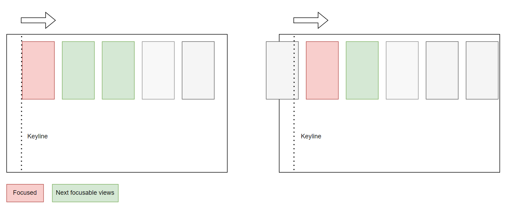

# Scrolling Recipes

## Scrolling to specific positions

To scroll to a specific position, use the selection methods from `DpadRecyclerView`:

- `setSelectedPosition` - to scroll immediately to a given position
- `setSelectedPositionSmooth` - to smooth scroll to a given position

If you're interested in triggering a callback once the selection is applied, you can do the following:

```kotlin linenums="1"
recyclerView.setSelectedPosition(0, object : ViewHolderTask() {
    override fun execute(viewHolder: RecyclerView.ViewHolder) {
        // ViewHolder was selected and aligned to its final location
    }
})
```

## Disabling smooth scrolling

`DpadRecyclerView` allows disabling smooth scrolling on focus changes with:

```kotlin
recyclerView.setSmoothFocusChangesEnabled(false)
```

This will make `DpadRecyclerView` scroll immediately without any animation to the new focused view.


## Changing smooth scrolling behavior

The code below changes the default interpolator used for smooth scrolling to a linear interpolator:

```kotlin linenums="1"
val linearInterpolator = LinearInterpolator()
recyclerView.setSmoothScrollBehavior(
    object : DpadRecyclerView.SmoothScrollByBehavior {
        override fun configSmoothScrollByDuration(dx: Int, dy: Int): Int {
            return RecyclerView.UNDEFINED_DURATION
        }

        override fun configSmoothScrollByInterpolator(dx: Int, dy: Int): Interpolator {
            return linearInterpolator
        }
    }
)
```

To slow down the smooth scrolling speed, check `setSmoothScrollSpeedFactor`:

```kotlin
recyclerView.setSmoothScrollSpeedFactor(2f)
```

The code above will make smooth scrolling twice slower.

## Limiting number of pending alignments

Sometimes you might want to prevent the user from scrolling past too many items.
You can specify the number of max pending alignments with: `setSmoothScrollMaxPendingAlignments`:

```kotlin
recyclerView.setSmoothScrollMaxPendingAlignments(2)
```

The code above translates to this behavior:



In the right scenario, there's just one next focusable view since the focused view still isn't aligned to the keyline.


